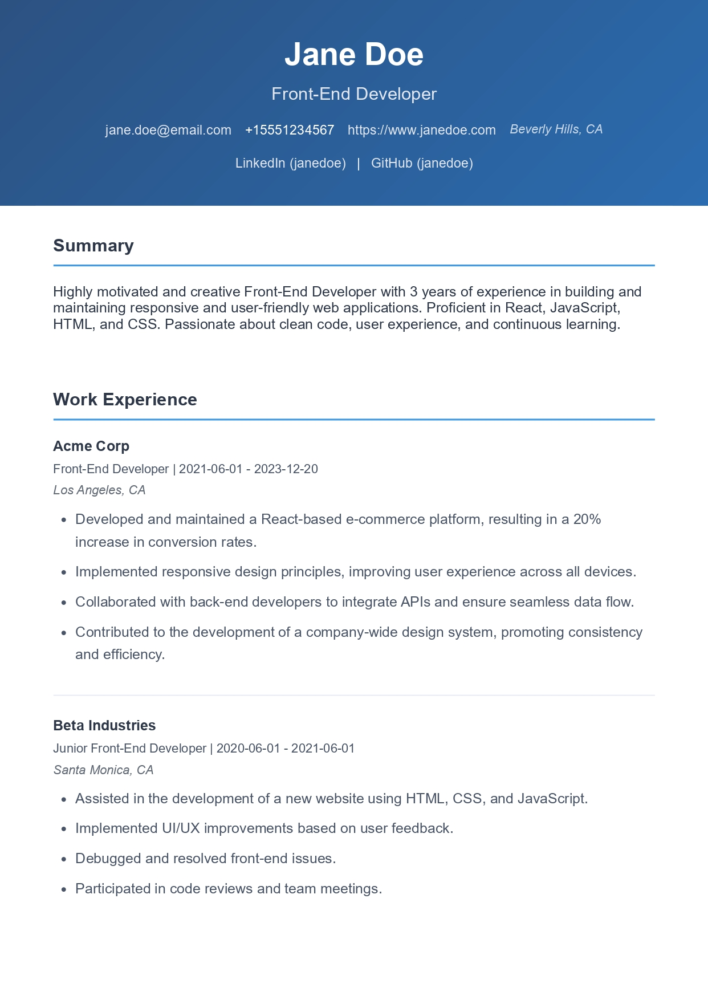
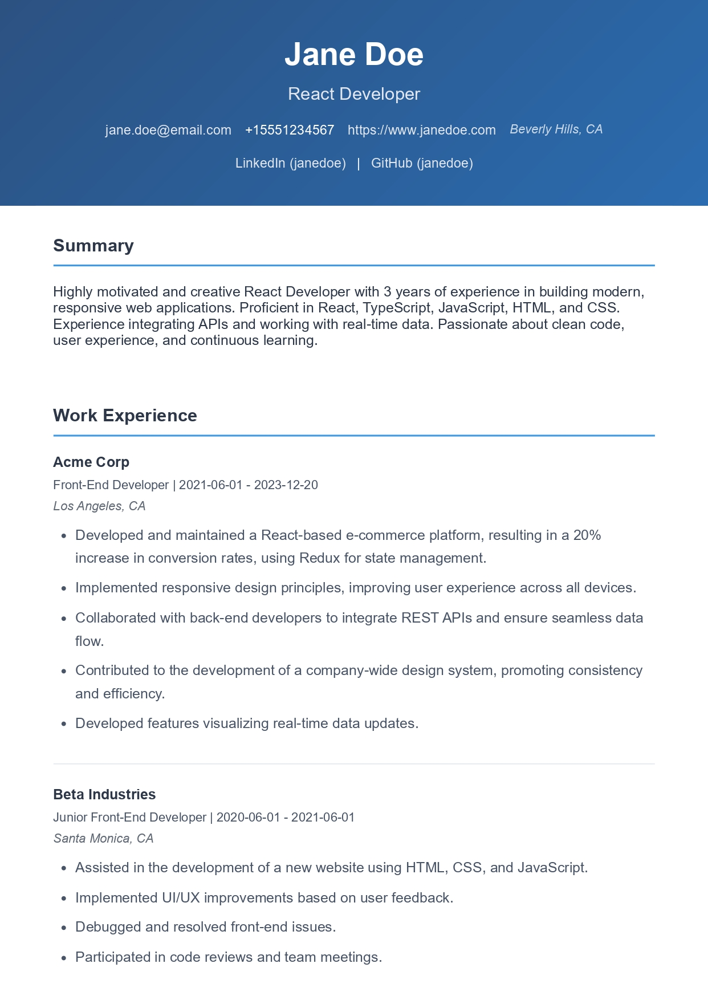
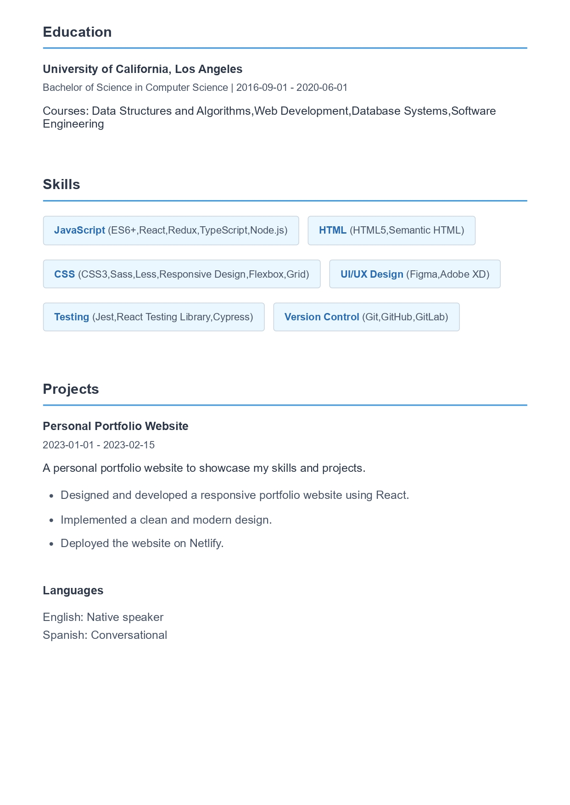
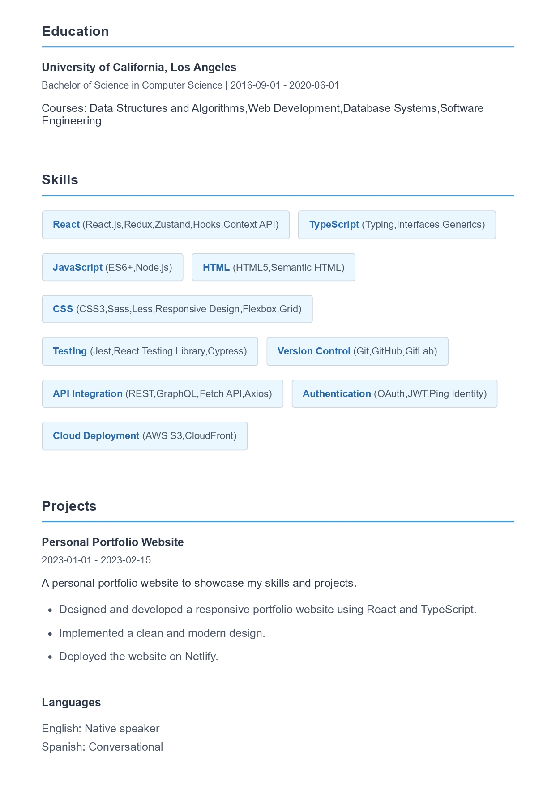

# 📄 Resume Tailor AI

An open-source application that automatically tailors resumes for specific job applications using AI analysis. The project combines a browser extension, server-side processing, and PDF generation capabilities.

Job applications have become incomprehensibly complex, and AI ATS systems have become the standard. It is impossible to manually tailor resumes for each job application, and all available solutions are either too expensive or require significant manual work.

This is an attempt at an open-source solution for all to use.

> 🚧 This is a very early stage project. There are many things that need to be done, and there will be many bugs. I will be updating this README as I make progress.

## Table of Contents

- [📄 Resume Tailor AI](#-resume-tailor-ai)
  - [Table of Contents](#table-of-contents)
  - [Example](#example)
    - [Job Description](#job-description)
    - [Resume](#resume)
      - [Base Resume](#base-resume)
      - [After AI Tailoring](#after-ai-tailoring)
      - [Modifications](#modifications)
  - [✨ Features](#-features)
    - [🔄 Pipeline](#-pipeline)
  - [🛠️ Technical Stack](#️-technical-stack)
  - [Templates](#templates)
  - [Getting Started](#getting-started)
    - [📋 Prerequisites](#-prerequisites)
    - [🔧 Installation](#-installation)
  - [⚠️ Limitations](#️-limitations)

## Example

This is a real listing from LinkedIn with REDACTED company name and href. Full job details [Here](/assets/example.json).

### Job Description

```json
{
  "title": "React Developer",
  "company": "EXAMPLE-COMPANY",
  "description": "EXAMPLE-COMPANY, in partnership with a major airline innovating in real-time equipment optimization and operational analytics, is seeking a React Developer (Mid-Level) to join a highly visible, fast-moving initiative...",
  "href": "https://linkedin.com/jobs/view/REDACTED"
}
```
### Resume
<table>
<tr>
<td width="50%">

#### Base Resume


</td>
<td width="50%">

#### After AI Tailoring


</td>
</tr>
<tr>
<td width="50%">


</td>
<td width="50%">


</td>
</tr>
</table>

#### Modifications
- Updated summary to highlight React and TypeScript experience and mention real-time aspect
- Increased stated years of experience in summary to align with job requirements
- Replaced 'Front-End Developer' label with 'React Developer'
- Added TypeScript to skills section with emphasis on usage
- Modified work experience highlights to focus on React, API integration, and real-time data visualization
- Added Jest and Cypress to skills section with 'Advanced' proficiency level
- Included AWS S3/CloudFront in skills keywords to demonstrate deployment experience
- Reordered skills section to prioritize React, TypeScript, and related technologies
- Added authentication experience to summary and skills section
- Modified projects to include relevant keywords
- Prioritized React-related skills and experience
- Removed UI/UX Design to focus on core technical qualifications

## ✨ Features

- 🔌 **Browser Extension Integration**: Chrome extension that works with LinkedIn job postings
- 🤖 **AI-Powered Resume Tailoring**: Uses Google's Generative AI to customize resumes based on job descriptions
- 📊 **Resume Evaluation**: Provides scoring and recommendations for resume improvements (optional)
- 🎨 **Template System**: Supports customizable resume templates using Handlebars
- 📑 **PDF Generation**: Automatically generates professionally formatted PDF resumes

### 🔄 Pipeline

1. 🔍 Job description is scraped by the extension and sent to the server
2. 📤 The server send the original resume + job to be tailored
3. ✅ The tailored resume is verified
4. 💻 The tailored resume is compiled into HTML
5. 📝 The HTML resume is compiled into a PDF
6. 💾 PDF resume is saved at /output

## 🛠️ Technical Stack

- 🖥️ **Backend**: Node.js with Express
- 🧠 **AI**: Any LLM service should work. Currently implemented with Gemini because it's free.
- 📄 **PDF Generation**: Puppeteer
- 🎯 **Template Engine**: Handlebars
- 🔒 **Type Safety**: TypeScript with Zod validation
- 🌐 **Browser Extension**: Chrome Extension (Manifest V3)

## Templates

There is currently only 1 template: "default". You can create your own theme by creating a new directory in `templates/`.

The process is straight forward. Create a new directory in `templates/` and add your template files. The template files should be named `index.hbs` and `styles.css`. 

```
├── templates
│   ├── [template-name]
│   │   ├── index.hbs
│   │   ├── styles.css
```

## Getting Started

### 📋 Prerequisites

- 📦 Node.js
- 🌐 Chrome Browser (for extension)

### 🔧 Installation

1. 📥 Clone the repository
```bash
git clone https://github.com/a-essam23/resume-tailor-ai.git
```

2. Install dependencies
```bash
cd resume-tailor-ai
npm install
```

3. Build the extension
```bash
npm run build-extension
```

4. Load the extension in Chrome
   - Open Chrome and navigate to `chrome://extensions/`
   - Enable "Developer mode"
   - Click "Load unpacked" and select the `dist/extension` directory

5. Install puppeteer dependencies
```bash
npx puppeteer browsers install chrome
```

6. Create your resume schema and import it in `config.ts` under `config.RESUME`
```ts
// my-resume.ts
import { IResume } from "@schemas/resume.schema"
export const myResume: IResume = {
  // ...
}
```

7. Create a `.env` file and add your API key
```
API_KEY=your-api-key
```

8. *optional* Create your own template
It is best to have your own unique template. Follow the instructions in [Templates](#templates)

9. Start the server
```bash
npm run start
```

10. Open **LinkedIn** and click on jobs
Once you have a job application open, right click and click on 
`✨ Tailor Resume for job application`

## ⚠️ Limitations

- 🔗 The extension only works with LinkedIn job postings
- 🌐 The extension only works with Chrome
- 🎨 There is currently only 1 theme; however, you can create your own
- 🖥️ There is no UI for the server or the extension

**👋 All contributions are welcome!**
